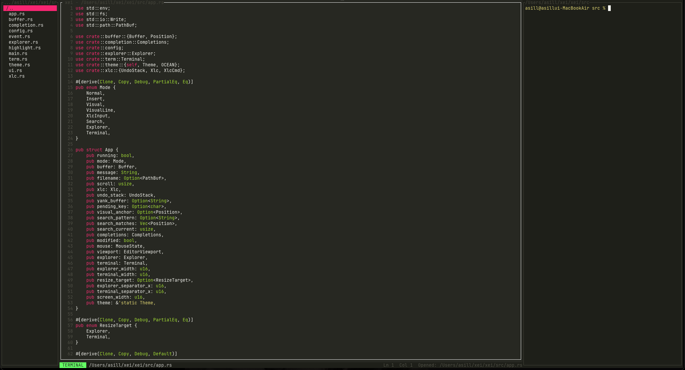

# xei  晴

> A modern Vim-like terminal editor in Rust.



```bash
npm install -g xei-editor       # npm
brew install stremtec/xei/xei   # Homebrew
cargo install xei               # Cargo
```

**Windows (PowerShell):**
```powershell
iwr https://raw.githubusercontent.com/stremtec/xei/master/install.ps1 | iex
```

**macOS / Linux:**
```bash
curl -fsSL https://raw.githubusercontent.com/stremtec/xei/master/install.sh | bash
```

```bash
xei                  # blank buffer
xei src/main.rs      # open a file
xei --version        # print version
```

## Keybindings

### Normal Mode

| Key | Action |
|---|---|
| `h` `j` `k` `l` / `←↓↑→` | Move cursor |
| `w` `b` | Next / previous word |
| `0` `$` | Start / end of line |
| `gg` `G` | Top / bottom of file |
| `i` | Enter Insert mode at cursor |
| `a` | Enter Insert mode after cursor |
| `A` | Enter Insert mode at end of line |
| `o` | Open new line below, enter Insert |
| `O` | Open new line above, enter Insert |
| `x` | Delete character under cursor |
| `dd` | Delete current line (yanked) |
| `dw` | Delete current word (yanked) |
| `p` | Paste yanked text |
| `u` | Undo |
| `v` | Enter Visual mode |
| `V` | Enter Visual Line mode |
| `/` | Search forward |
| `n` `N` | Next / previous search match |
| `:` | Open XLC command panel |

### Visual Mode

| Key | Action |
|---|---|
| `h` `j` `k` `l` / `←↓↑→` | Extend selection |
| `w` `b` | Jump by word |
| `0` `$` | Start / end of line |
| `G` | Jump to bottom |
| `d` | Delete selection (yanked) |
| `y` | Yank (copy) selection |
| `Cmd+C` | Copy to system clipboard |
| `Esc` | Return to Normal |

### Insert Mode

| Key | Action |
|---|---|
| `Esc` | Return to Normal |
| `←↓↑→` | Move cursor |
| `Tab` | Insert 4 spaces (or apply completion) |
| `Ctrl+A` | Trigger autocomplete |
| `Cmd+V` | Paste from system clipboard |

### Panels

| Key | Action |
|---|---|
| `Ctrl+F` | Toggle file explorer (left) |
| `F12` | Toggle built-in terminal (right) |
| `Ctrl+E` | Toggle XLC command panel (bottom) |
| `Ctrl+Q` / `Esc` | Close terminal |

### Explorer

| Key | Action |
|---|---|
| `j` `k` / `↓↑` | Navigate entries |
| `Enter` / `l` | Open file or enter directory |
| `h` | Go to parent directory |
| `Esc` | Return to Normal |

### Mouse

| Action | Behavior |
|---|---|
| Click | Move cursor |
| Drag | Select text (enters Visual) |
| Scroll | Navigate document |
| Drag panel border | Resize explorer / terminal / XLC |

## XLC Commands (`:`)

| Command | Action |
|---|---|
| `:w` `:save` | Save file |
| `:w <path>` | Save as new path |
| `:e <file>` `:open <file>` | Open file |
| `:q` `:quit` | Quit (warns if unsaved) |
| `:q!` `:quit!` | Force quit |
| `:wq` `:x` | Save and quit |
| `:mv <dest>` `:move <dest>` | Move / rename current file |
| `:rename <name>` | Rename in same directory |
| `:rm` | Delete current file |
| `:pwd` | Show working directory |
| `:ls` | List files |
| `/pattern` `:find <pat>` | Search in buffer |
| `:theme` | List themes |
| `:theme <name>` | Switch theme |
| `:help` `:h` `:?` | Show all commands |

Scroll XLC output: `Ctrl+U` / `Ctrl+D` / `PgUp` / `PgDn`

## Themes

`ocean` (default) · `monokai` · `nord` · `solarized` · `gruvbox` · `everforest` · `sakura` · `newspaper` · `mono` · `mono_dark`

```bash
:theme sakura    # switch immediately, persists to ~/.xei.toml
```

## Configuration

`~/.xei.toml` (auto-saved on theme change):

```toml
theme = "gruvbox"
```

## License

MIT
